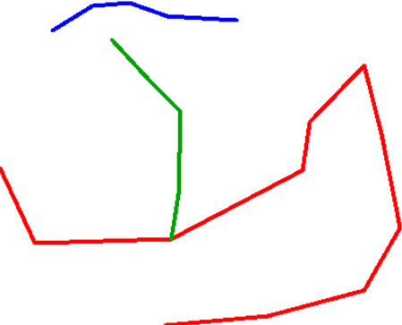

# VoronoiLines Version 1

This is my first attempt at creating voronois for polygons. It does a reasonable job howeber it does fall over when dealing with intersects.

## Method

1. Generate points at all vertices/nodes of all selected lines, give these points some same ID 
2. Voronoi these points
3. Combine the polygons where ID are the same
4. Transfer column data from lines layer to polygons layer.

## Downfalls

The main downfall of this algorithm can be shown in the below example.

[V1Test](V1Result.png)

Essentially what hapenned here is that where the green line met the red, that green vertice was lost in the voronoi so it wasn't taken into account. That's one problem but not the main problem as shown in this example:

